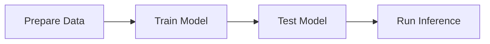

# Quick Start

This guide will walk you through using leech for the first time.

## Prerequisites

- [Install leech](installation.md)
- POD5 file with nanopore signal data
- BAM file with basecalls and move tables (from dorado/guppy with `--emit-moves`)

## What you will do

The leech workflow has four steps, each handled by a dedicated CLI command:



1. **Prepare** (`leech data prepare`) — read raw signal from a POD5 file and alignments from a BAM file, extract dwell times and signal statistics centered on a sequence motif, and split the resulting chunks into train/val/test sets at the read level.
2. **Train** (`leech model train`) — fit a multi-branch neural network that takes signal, sequence, and dwell features as separate inputs and learns to classify modification state.
3. **Test** (`leech eval test`) — evaluate the trained model on a held-out test set and report accuracy, precision, recall, F1, and AUC.
4. **Predict** (`leech predict`) — apply the model to new POD5/BAM data and write modification probabilities into an output BAM file.

## Step 1: Prepare Training Data

Extract features from your POD5 and BAM files:

```bash title="Bash" linenums="1"
uv run leech data prepare \
  --pod5 reads.pod5 \
  --bam alignments.bam \
  --output-dir chunks/ \
  --feature-set signal+dwell+levels \
  --motif CCAGGC \
  --motif-offset 2 \
  --label 1
```

### Key Parameters

- `--pod5`: Path to POD5 file with raw signal
- `--bam`: Path to BAM file with alignments and move tables
- `--output-dir`: Directory to save training chunks
- `--feature-set`: Features to extract (`signal`, `dwell`, `levels`, or combinations)
- `--motif`: Sequence motif to center on (e.g., "CCAGGC" for tRNA 3' end)
- `--motif-offset`: Position within motif to focus on (0-indexed)
- `--label`: Class label (0 or 1)

### Parallel Processing

For large datasets, use parallel processing:

```bash title="Bash" linenums="1"
uv run leech data prepare \
  --pod5 reads.pod5 \
  --bam alignments.bam \
  --output-dir chunks/ \
  --workers 8 \
  --chunk-size 100
```

This will process reads in parallel across 8 CPU cores.

## Step 2: Train a Model

Train a model on your prepared data:

```bash title="Bash" linenums="1"
uv run leech model train \
  --train-data chunks/train.json \
  --val-data chunks/val.json \
  --model ConvLSTMDwell \
  --output-dir models/ \
  --epochs 50 \
  --batch-size 128 \
  --learning-rate 0.001
```

### Available Models

- `ConvLSTMDwell`: Multi-branch Conv-LSTM with dwell features (recommended)
- `ConvLSTMBase`: Baseline without dwell features
- `TransformerDwell`: Transformer with self-attention
- `ConvOnly`: Pure convolutional network
- `TCNDwell`: Temporal Convolutional Network
- `ResNetDwell`: Residual network

### Training Output

The training process will save:

- `model_best.pt`: Best model checkpoint (by validation loss)
- `model_checkpoint.pt`: Latest checkpoint
- `training_history.json`: Training metrics over time

## Step 3: Test the Model

Evaluate your trained model:

```bash title="Bash" linenums="1"
uv run leech eval test \
  --model models/model_best.pt \
  --test-data chunks/test.json \
  --output metrics.json
```

This will output:

- Accuracy, precision, recall, F1 score
- Confusion matrix
- ROC-AUC score
- Per-class metrics

### Example Output

```json title="JSON" linenums="1"
{
  "accuracy": 0.96,
  "precision": 0.95,
  "recall": 0.97,
  "f1": 0.96,
  "auc": 0.98,
  "confusion_matrix": [[1850, 50], [30, 1970]]
}
```

## Step 4: Run Inference

Apply your model to new data:

```bash title="Bash" linenums="1"
uv run leech predict \
  --model models/model_best.pt \
  --pod5 new_reads.pod5 \
  --bam new_alignments.bam \
  --output predictions.bam
```

The output BAM file will contain modification probability tags for each base.

## Beyond single-sample workflows

The steps above cover a single-sample classification. For multi-sample experiments (e.g., preparing charged and uncharged data separately, then merging), see `leech data merge` in the [CLI Reference](../reference/cli.md). The merge command handles read-level splitting across samples to prevent data leakage.

## Deploying with model bundles

When you have multiple pairwise models (e.g., Ala vs Gly, Ala vs Val, ...),
package them into a single bundle for deployment:

```bash title="Bash" linenums="1"
# Bundle all pairwise models
leech model bundle \
  --model-dir models/pairwise/ \
  --output bundle.pt \
  --version 1.0.0

# Run all models on new data (aggregated amino acid prediction)
leech predict \
  --bundle bundle.pt --all \
  --pod5 new_reads.pod5 --bam new_alignments.bam \
  --output predictions.bam
```

See the [CLI Reference](../reference/cli.md) for full bundle and inference options.

## Next steps

- **[Data Preparation](../data_preparation.md)** — parallel processing, motif search, multi-sample merging
- **[Understanding Move Tables](../guides/move-tables.md)** — how leech decodes the BAM `mv` tag into per-base dwell times
- **[Dwell Time Features](../guides/dwell-features.md)** — the 9-channel feature set and model architecture
- **[Classification Tasks](../guides/classification-tasks.md)** — charged vs. uncharged, pairwise amino acid, and chemical property comparisons
- **[Grid Search](../grid-search/grid-search-usage.md)** — optimize signal context and hyperparameters
- **[CLI Reference](../reference/cli.md)** — all commands including training improvements and bundle workflows
