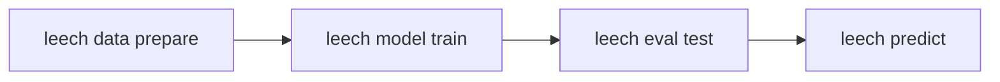

# Leech

<b>L</b>earning <b>E</b>nhanced <b>E</b>lectrical <b>C</b>lassifiers from <b>H</b>anopore signals

Leech classifies aminoacylation state and amino acid identity from Oxford
Nanopore tRNA sequencing data. It extracts **dwell time features** from move
tables (the BAM `mv` tag) and feeds them alongside raw signal and sequence
context into a multi-branch neural network, giving it information that
signal-only tools like [Remora](https://github.com/nanoporetech/remora)
discard.

## Workflow

1. **Prepare** -- extract signal, sequence, and dwell features from POD5 + BAM files
2. **Train** -- fit a multi-branch neural network on the extracted features
3. **Test** -- evaluate on held-out data (accuracy, AUC, confusion matrix)
4. **Predict** -- apply the model to new reads and write predictions to BAM

## Documentation

-   **[Installation](getting-started/installation.md)**

    Set up leech with uv or pip

-   **[Quick Start](getting-started/quick-start.md)**

    Walk through prepare, train, test, predict

-   **[CLI Reference](reference/cli.md)**

    All commands, options, and workflows

-   **[Understanding Move Tables](guides/move-tables.md)**

    How leech decodes the BAM `mv` tag

-   **[Dwell Time Features](guides/dwell-features.md)**

    The 9-channel feature set and model architecture

-   **[Classification Tasks](guides/classification-tasks.md)**

    Charged vs. uncharged and amino acid discrimination

-   **[Grid Search](grid-search/grid-search-usage.md)**

    Optimize signal context and hyperparameters

-   **[Data Preparation](data_preparation.md)**

    Parallel processing, motif search, multi-sample merging

-   **[Snakemake Pipeline](pipeline.md)**

    Production workflows for HPC clusters

-   **[Troubleshooting](troubleshooting.md)**

    Common issues and solutions

## Citation

If you use leech, please cite:

- This work (publication pending)
- [Remora](https://github.com/nanoporetech/remora) (underlying training framework)

## License

MIT License -- see [LICENSE](https://github.com/rnabioco/leech/blob/main/LICENSE) for details.
