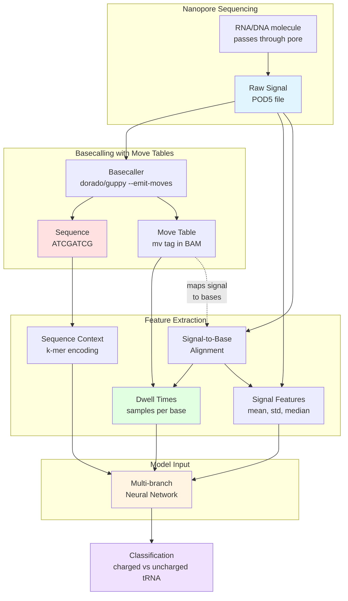

# Leech

<b>L</b>earning <b>E</b>nhanced <b>E</b>lectrical <b>C</b>lassifiers from <b>H</b>anopore signals

## What leech does

In aminoacyl-tRNA sequencing (aa-tRNA-seq), the key biological question is
whether a tRNA molecule is **charged** (carrying an amino acid) or
**uncharged**. Charged tRNAs can further be classified by which amino acid is
attached. Oxford Nanopore sequencing captures these differences as subtle
changes in electrical signal as the tRNA passes through the pore, but
standard basecalling discards the timing information needed to detect them.

Leech recovers that timing information. It reads **move tables** (the `mv`
tag in BAM files produced by Dorado) to compute how long the pore dwells on
each base, then feeds dwell times alongside the raw signal and sequence
context into a multi-branch neural network. This combination of signal,
sequence, and dwell features is what separates leech from tools like
[Remora](https://github.com/nanoporetech/remora) that operate on signal
alone.

## How it works

Leech integrates three complementary data sources from nanopore sequencing to improve classification accuracy:

**Key Insight**: While sequence alone may show basecalling errors at modification sites, and raw signal alone lacks base-level resolution, **dwell time** provides the critical link—revealing how long the nanopore spent measuring each base, which is highly informative for detecting modifications like tRNA aminoacylation.

## Key capabilities

- **[Move table decoding](guides/move-tables.md)** — parse the BAM `mv` tag to map raw signal to individual bases
- **[Dwell time features](guides/dwell-features.md)** — extract per-base dwell times and signal-level statistics that capture modification signatures
- **[Classification tasks](guides/classification-tasks.md)** — charged vs. uncharged tRNAs, pairwise amino acid discrimination, and chemical property grouping
- **[Multiple model architectures](architecture.md)** — Conv-LSTM, Transformer, TCN, ResNet, and CNN variants, all with multi-branch inputs
- **[Parallel data preparation](data_preparation.md)** — multiprocessing support for large datasets with 3--6x speedup
- **[Snakemake pipeline](grid-search/grid-search.md)** — production-ready workflows for HPC clusters (SLURM/LSF)

## Get started

Install leech and run through the four-step workflow—prepare, train, test, predict—in about ten minutes:

1. **[Installation](getting-started/installation.md)** — set up leech with uv or pip
2. **[Quick Start](getting-started/quick-start.md)** — walk through a complete classification workflow

## Citation

If you use `leech`, please cite:

- This work (publication pending)
- [Remora](https://github.com/nanoporetech/remora) (underlying training framework)

## License

MIT License - see [LICENSE](https://github.com/rnabioco/leech/blob/main/LICENSE) file for details.

## Related Projects

- [Remora](https://github.com/nanoporetech/remora) - Modified base detection for nanopore sequencing
- [POD5](https://github.com/nanoporetech/pod5-file-format) - Efficient file format for nanopore signal data
- [Snakemake](https://snakemake.readthedocs.io/) - Workflow management system
