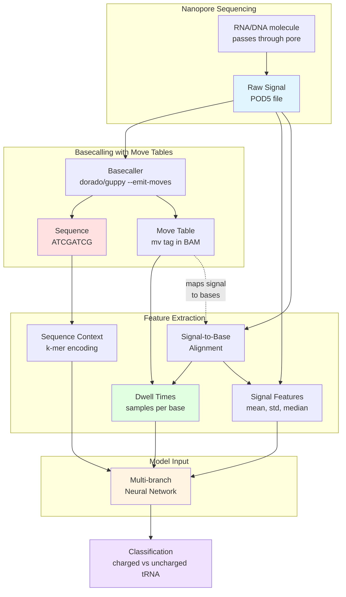
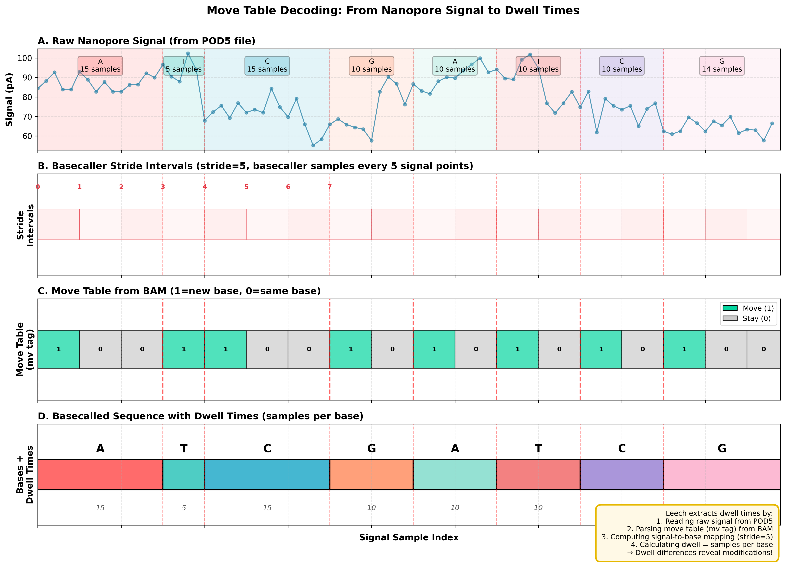
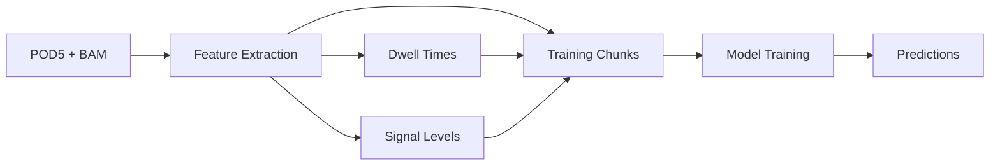

# Leech

**L**earning **E**nhanced **A**minoacylation **C**lassification from **H**anopore signals

A Python library for training machine learning models on nanopore signal data, with a focus on integrating dwell time features for modified base detection.

[](https://github.com/rnabioco/leech/actions/workflows/ci.yml)
[](https://www.python.org/downloads/)
[](https://opensource.org/licenses/MIT)

## Overview

`leech` extends [Remora](https://github.com/nanoporetech/remora) with dwell time features extracted from move tables (`mv` tag in BAM files) to classify modified bases, specifically for distinguishing charged vs. uncharged tRNAs in aa-tRNA-seq experiments.

### Key Features

- **Dwell time integration**: Extract per-base dwell times from move tables
- **Signal level features**: Compute signal statistics (mean, median, std, range) per base
- **PyTorch models**: Conv-LSTM architectures with multi-branch inputs (signal + sequence + dwell features)
- **Snakemake pipeline**: Production-ready workflow for HPC clusters (SLURM/LSF)
- **Modern tooling**: Built with uv, ruff, and type hints

## How It Works

Leech integrates three complementary data sources from nanopore sequencing to improve classification accuracy:



**Key Insight**: While sequence alone may show basecalling errors at modification sites, and raw signal alone lacks base-level resolution, **dwell time** provides the critical link—revealing how long the nanopore spent measuring each base, which is highly informative for detecting modifications like tRNA aminoacylation.

### The Dwell Time Advantage

The figure below illustrates how leech extracts dwell times from move tables:



**Panel A** shows the raw nanopore signal with colored regions indicating different bases. **Panel B** displays stride positions where the basecaller samples the signal. **Panel C** shows the move table (from BAM `mv` tag) with 1s indicating new bases and 0s indicating the pore is still reading the same base. **Panel D** combines the sequence with per-base dwell times calculated from the move table.

Modified bases (like charged tRNAs) often exhibit **different translocation kinetics** through the nanopore, resulting in distinctive dwell time patterns that leech models can learn to recognize.

??? note "Technical Details: Move Table Format"

    The move table is stored in the BAM `mv` tag with format: `[stride, move_0, move_1, ..., move_n]`

    ```
    Raw signal:  [s0, s1, s2, s3, s4, s5, s6, s7, s8, s9, s10, ...]
                  ↓   ↓   ↓   ↓   ↓   ↓   ↓   ↓   ↓   ↓    ↓
    Stride=5:    [0        ][1        ][2        ][3         ]...

    Move table:  [5, 1, 0, 0, 1, 1, 0, 1, ...]
                     ↑  ↑  ↑  ↑  ↑  ↑  ↑
                     A  A  A  T  C  C  G  ... (bases)

    Dwell times: Base A: 15 samples (3 strides × 5)
                 Base T: 5 samples  (1 stride × 5)
                 Base C: 10 samples (2 strides × 5)
                 Base G: 5 samples  (1 stride × 5)
    ```

    This mapping allows leech to compute per-base statistics on both the raw signal and dwell times, providing rich features for detecting modifications.

## Quick Start

### Installation

Requires Python 3.10+

=== "Using uv (recommended)"

    ```bash
    # Install uv if you don't have it
    curl -LsSf https://astral.sh/uv/install.sh | sh

    # Clone and install
    git clone https://github.com/rnabioco/leech.git
    cd leech
    uv sync
    ```

=== "Using pip"

    ```bash
    git clone https://github.com/rnabioco/leech.git
    cd leech
    pip install -e .
    ```

### Basic Usage

#### 1. Prepare training data

Extract features from POD5 and BAM files:

```bash
uv run leech data prepare \
  --pod5 reads.pod5 \
  --bam alignments.bam \
  --output-dir chunks/ \
  --feature-set signal+dwell+levels \
  --motif CCAGGC \
  --motif-offset 2 \
  --label 1
```

#### 2. Train model

```bash
uv run leech model train \
  --train-data chunks/train.json \
  --val-data chunks/val.json \
  --model ConvLSTMDwell \
  --output-dir models/
```

#### 3. Test model

```bash
uv run leech eval test \
  --model models/model_best.pt \
  --test-data chunks/test.json \
  --output metrics.json
```

#### 4. Run inference

```bash
uv run leech predict \
  --model models/model_best.pt \
  --pod5 new_reads.pod5 \
  --bam new_alignments.bam \
  --output predictions.bam
```

## Documentation

- **[Getting Started](getting-started/installation.md)**: Installation and setup instructions
- **[User Guide](guides/01-START_HERE_IMPLEMENTATION_GUIDE.md)**: Comprehensive implementation guides
- **[Cluster Setup](setup/ALPINE_SETUP.md)**: HPC cluster configuration (SLURM/LSF)
- **[API Reference](api/index.md)**: Detailed API documentation

## Architecture

### Data Flow



### Model Architectures

- **ConvLSTMDwell**: Multi-branch model with dwell time features (recommended)
- **ConvLSTMBase**: Baseline model without dwell features (for comparison)
- **TransformerDwell**: Transformer-based with multi-head self-attention
- **ConvOnly**: Pure CNN with multi-scale convolutions
- **TCNDwell**: Temporal Convolutional Network with dilated convolutions
- **ResNetDwell**: Deep residual network with skip connections

## Requirements

### Input Data

- **POD5 files**: Raw nanopore signal (from ONT sequencing)
- **BAM files**: Basecalls with move table tags (`mv`, `ns`, `ts`)
  - Generated by dorado/guppy basecaller with `--emit-moves` flag

### Software Dependencies

- **PyTorch**: Neural network training
- **pod5**: Reading ONT POD5 format
- **pysam**: BAM file parsing
- **polars**: Fast dataframe operations
- **numpy/scipy/scikit-learn**: Numerical operations and ML utilities

## Citation

If you use `leech`, please cite:

- This work (publication pending)
- [Remora](https://github.com/nanoporetech/remora) (underlying training framework)

## License

MIT License - see [LICENSE](https://github.com/rnabioco/leech/blob/main/LICENSE) file for details.

## Related Projects

- [Remora](https://github.com/nanoporetech/remora) - Modified base detection for nanopore sequencing
- [POD5](https://github.com/nanoporetech/pod5-file-format) - Efficient file format for nanopore signal data
- [Snakemake](https://snakemake.readthedocs.io/) - Workflow management system
