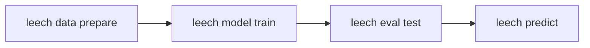

# Leech

!!! warning "Alpha quality — under active development"

    leech is alpha software. APIs, CLI flags, and output formats may change
    without notice, and bugs are expected. Validate results before relying on
    it for anything important.

<b>L</b>earning <b>E</b>nhanced <b>E</b>lectrical <b>C</b>lassifiers from <b>H</b>anopore signals

[](https://pypi.org/project/leech/)
[](https://github.com/rnabioco/leech/actions/workflows/ci.yml)
[](https://www.python.org/downloads/)
[](https://opensource.org/licenses/MIT)

Leech trains classifiers for motif-centered tasks on Oxford Nanopore signal
data -- modified-base calling, or any other label attached to a sequence
motif. It extracts **dwell time features** from move tables (the BAM `mv`
tag) and feeds them alongside raw signal and sequence context into a
multi-branch neural network, giving it information that signal-only tools
like [Remora](https://github.com/nanoporetech/remora) discard.

Development and validation used tRNA aminoacylation ("charging") state and
amino acid identity classification from direct RNA sequencing as the driving
example -- it shows up throughout the docs and the bundled Snakemake
pipeline -- but nothing in the feature extraction, model, or CLI is specific
to that assay: motifs, labels, and classes are all user-defined.

## Install

```bash
uv add "leech[rust]"     # or: pip install "leech[rust]"
```

Released on PyPI as [`leech`](https://pypi.org/project/leech/) plus
[`leech-core`](https://pypi.org/project/leech-core/), the optional Rust
accelerator pulled by the `rust` extra. See
[Installation](getting-started/installation.md) for the from-source path and
platform notes.

## Workflow



1. **Prepare** -- extract signal, sequence, and dwell features from POD5 + BAM files
2. **Train** -- fit a multi-branch neural network on the extracted features
3. **Test** -- evaluate on held-out data (accuracy, AUC, confusion matrix)
4. **Predict** -- apply the model to new reads and write predictions to BAM

## Documentation

<div class="grid cards" markdown>

-   **[Installation](getting-started/installation.md)**

    Set up leech with uv or pip

-   **[Quick Start](getting-started/quick-start.md)**

    Walk through prepare, train, test, predict

-   **[CLI Reference](reference/cli.md)**

    All commands, options, and workflows

-   **[Understanding Move Tables](guides/move-tables.md)**

    How leech decodes the BAM `mv` tag

-   **[Dwell Time Features](guides/dwell-features.md)**

    The 9-channel feature set and model architecture

-   **[Classification Tasks](guides/classification-tasks.md)**

    Binary and multi-way classification, worked through the tRNA
    charging/amino acid example

-   **[Grid Search](grid-search/grid-search-usage.md)**

    Optimize signal context and hyperparameters

-   **[Data Preparation](data_preparation.md)**

    Parallel processing, motif search, multi-sample merging

-   **[Snakemake Pipeline](pipeline.md)**

    Production workflows for HPC clusters

-   **[Troubleshooting](troubleshooting.md)**

    Common issues and solutions

</div>

## Citation

If you use leech, please cite:

- This work (publication pending)
- [Remora](https://github.com/nanoporetech/remora) (underlying training framework)

## License

MIT License -- see [LICENSE](https://github.com/rnabioco/leech/blob/main/LICENSE) for details.
